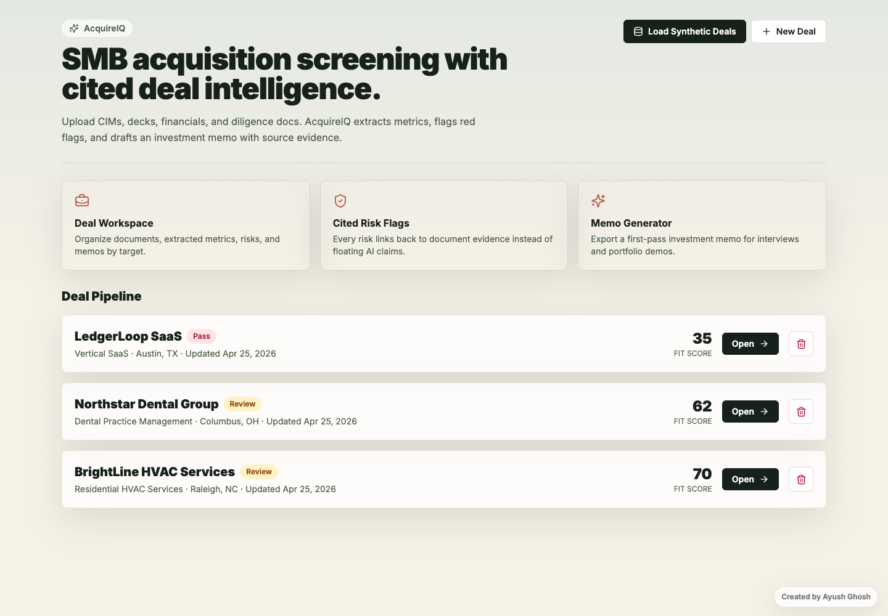
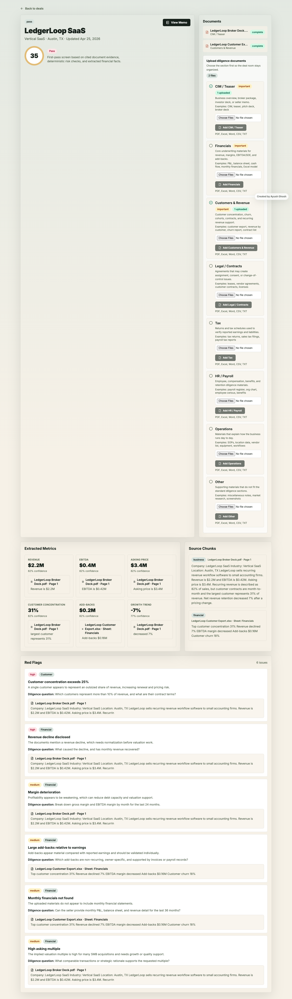
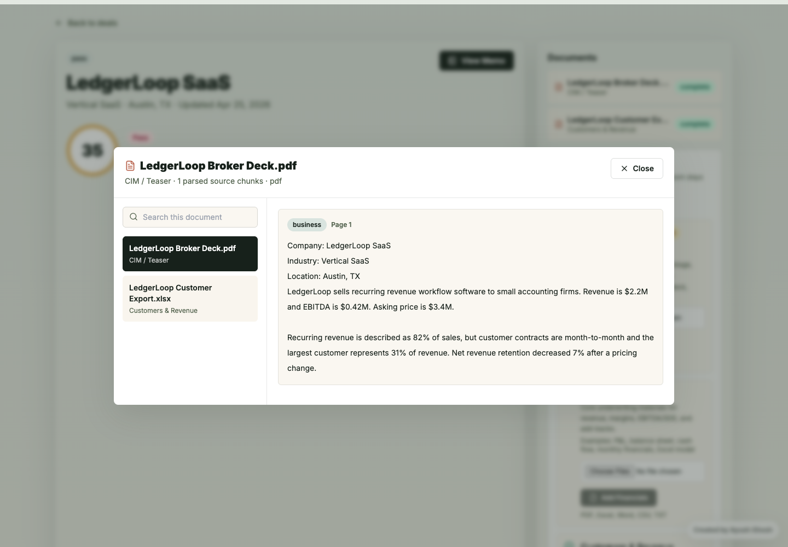
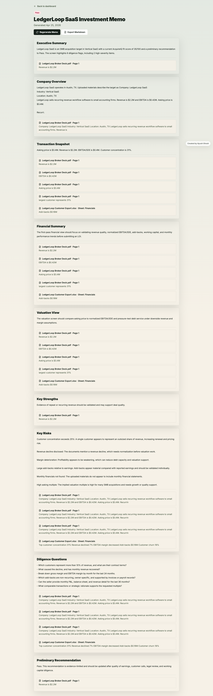

# AcquireIQ

AcquireIQ is a portfolio-ready SMB acquisition screening app for M&A workflows. It lets users organize deal workspaces, upload diligence documents, extract cited metrics, flag acquisition risks, preview source documents, and generate a first-pass investment memo.

## Features

- Deal pipeline dashboard with fit scores and recommendations
- Categorized diligence upload sections for CIMs, financials, customers, legal, tax, HR, operations, and other documents
- PDF, Excel, Word, CSV, and TXT upload support
- Parsed document preview with searchable source chunks
- Citation-backed metric extraction
- Deterministic M&A red flag scoring
- Investment memo generation with Markdown export
- Synthetic demo deals for safe portfolio demos
- Prisma schema for a future PostgreSQL production backend

## Screenshots

### Deal Pipeline

View acquisition targets, fit scores, recommendations, and quick actions from the main pipeline.



### Deal Dashboard

Review extracted metrics, source documents, diligence upload sections, and acquisition risk flags.



### Document Preview

Click any uploaded document to preview parsed source chunks and search within the file.



### Investment Memo

Generate a first-pass investment memo with cited deal evidence and diligence questions.



## Tech Stack

- Next.js
- React
- TypeScript
- Tailwind CSS
- Prisma schema
- Local JSON-backed demo storage

## Getting Started

```bash
npm install
npm run seed
npm run dev
```

Open `http://localhost:3000/deals`.

## Useful Commands

```bash
npm run build
npm run seed
```

## Notes

This is a V1 demo application, not a compliance-grade M&A platform. Synthetic data is included for public demos, and uploaded deal files are stored locally in development.
